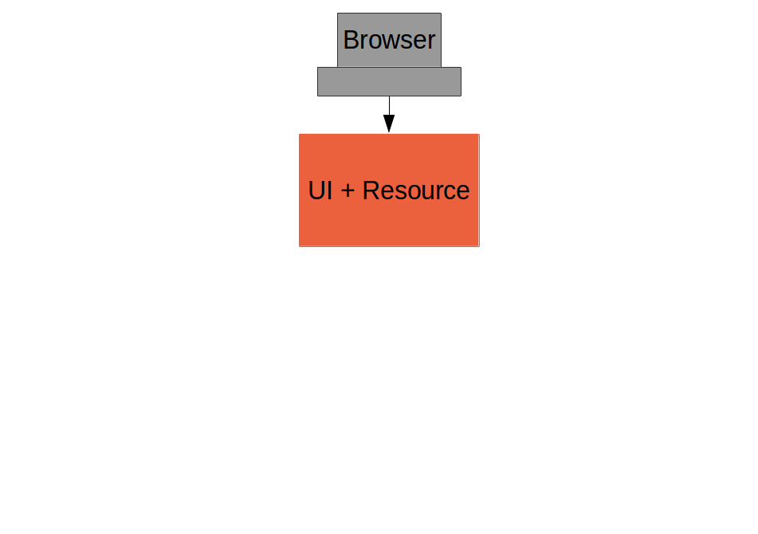
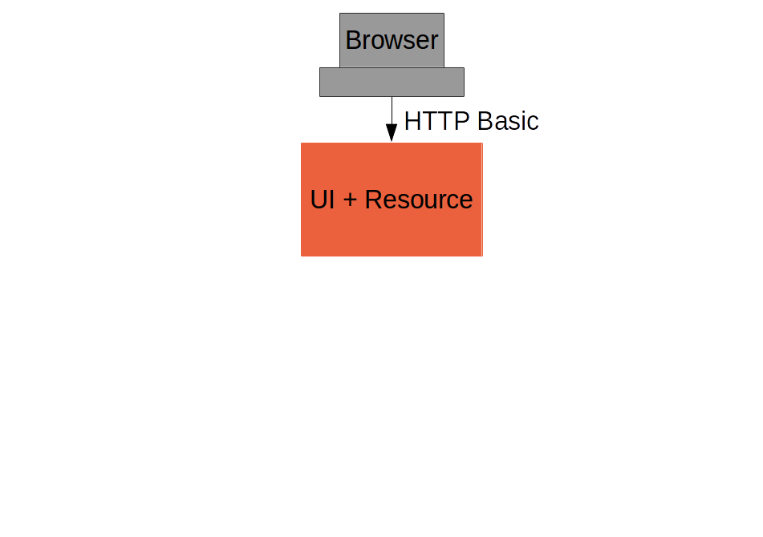
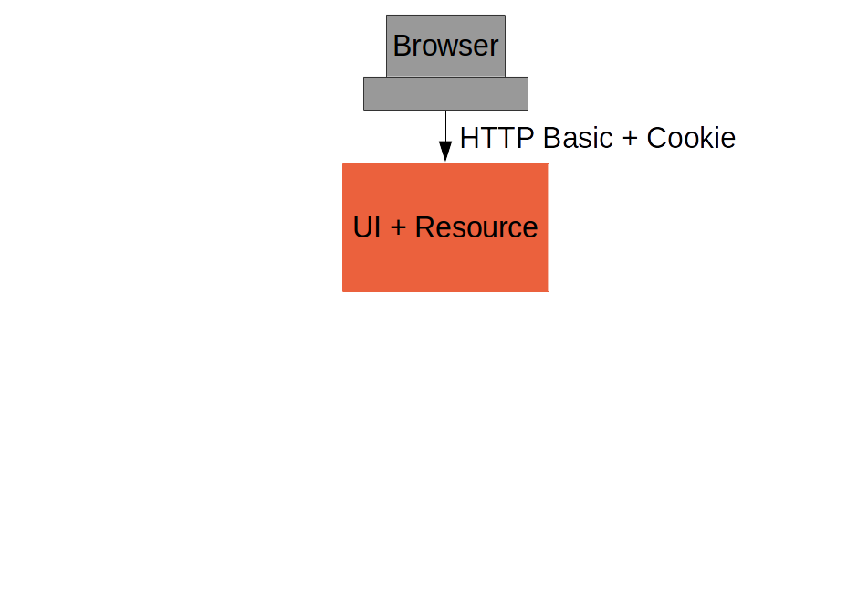
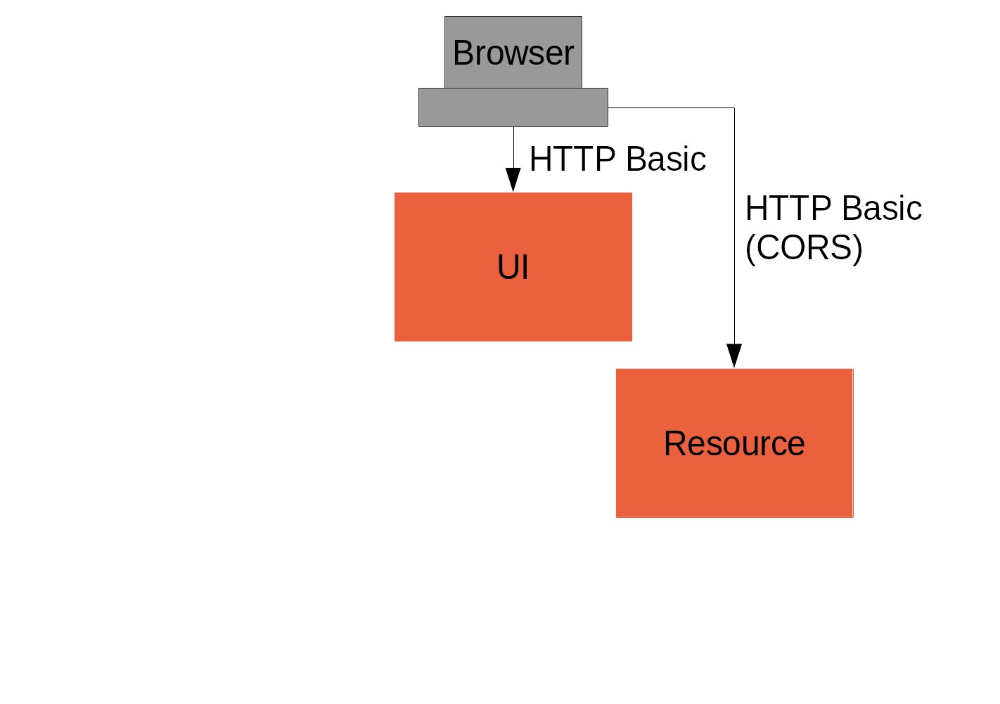
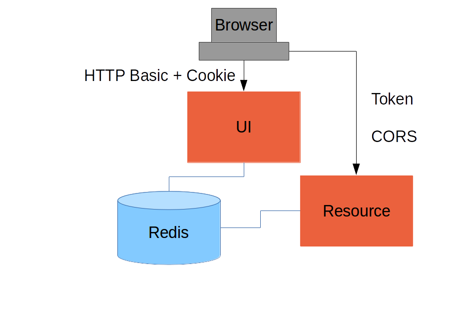
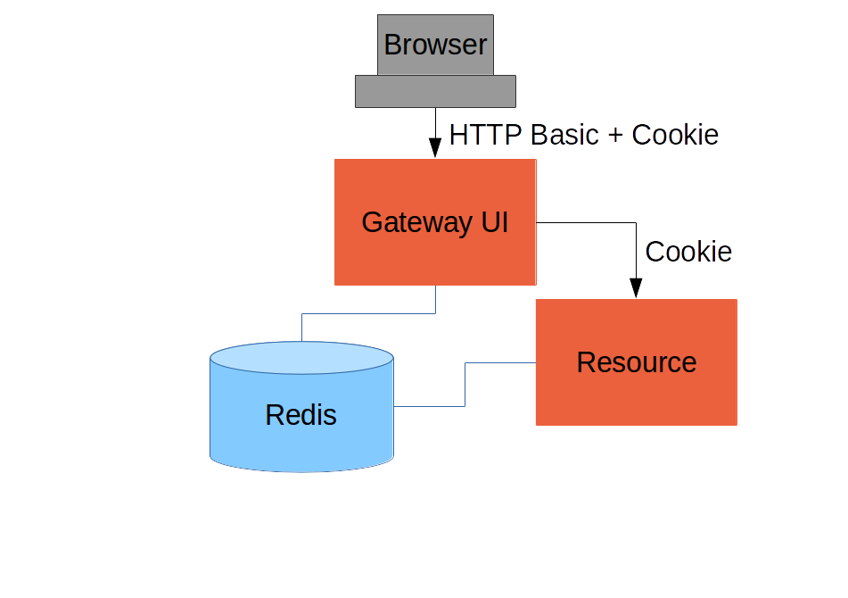
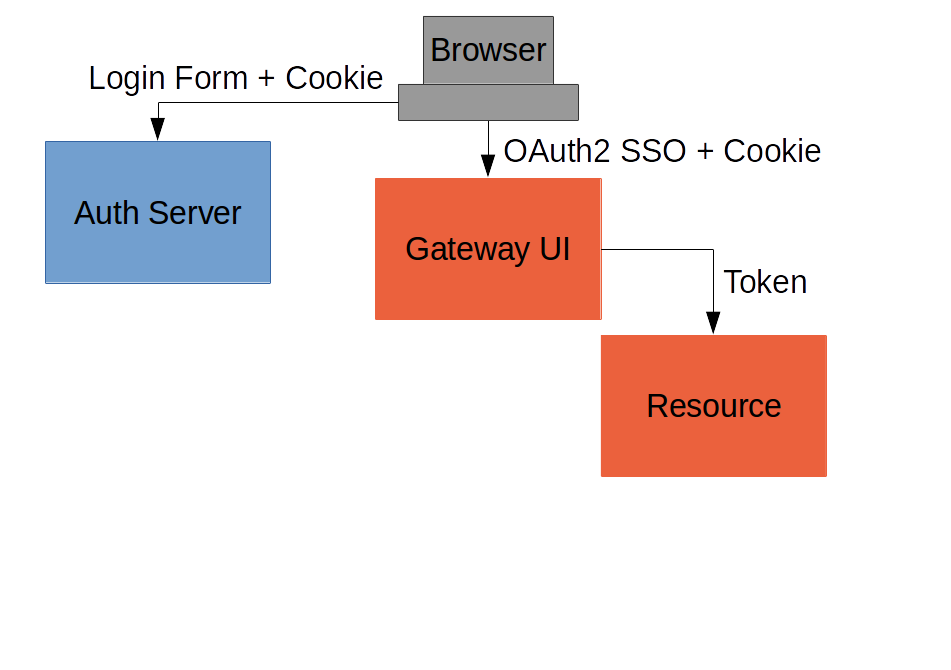
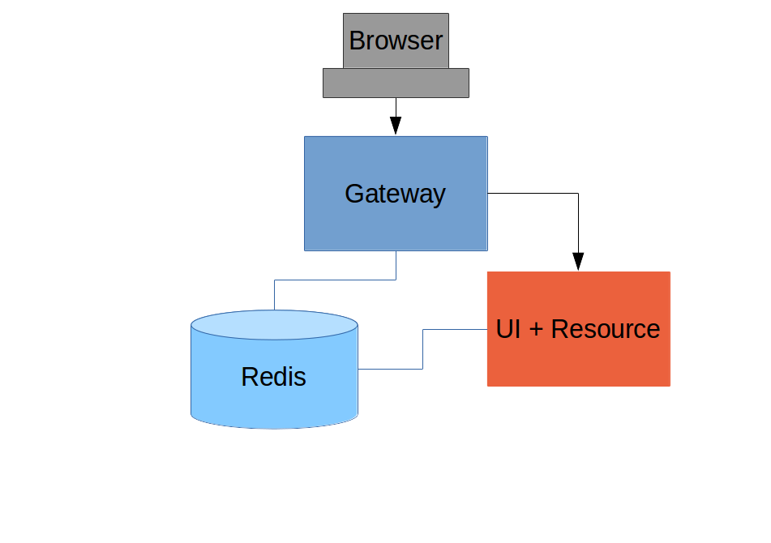
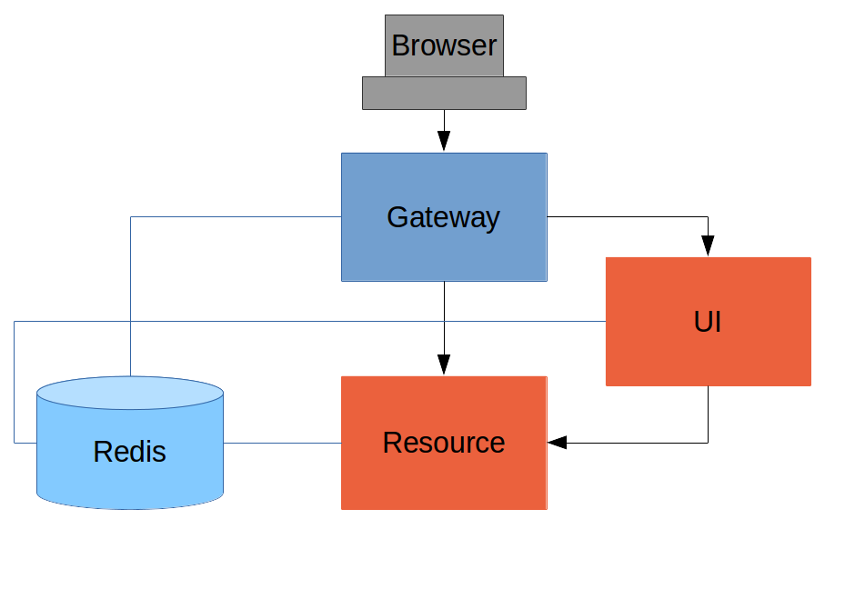
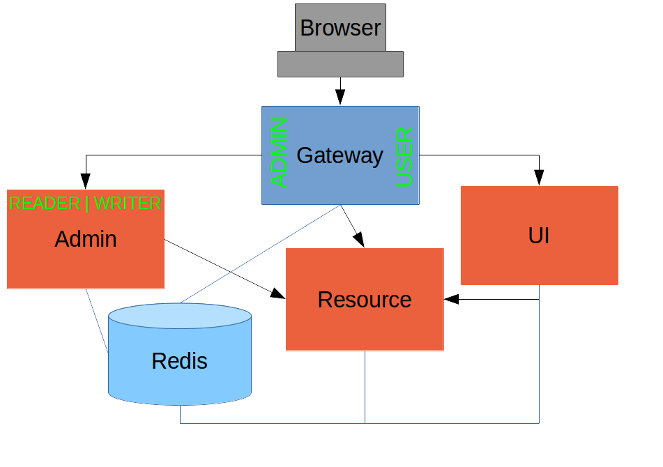

= Spring Security and Angular
Dave Syer, 2016
@david_syer
:backend: deckjs
:deckjs_transition: fade
:navigation:
:menu:
:status:
:goto:
:source-highlighter: pygments
:deckjs_theme: spring
:deckjsdir: ../deck.js

== Agenda

* Really quick introduction to Spring Security, Spring Session, Angular JS
* Focus on features to build secure, modern, single-page applications
* High level view of sample apps presented in http://spring.io/guides/tutorials/spring-security-and-angular-js/[tutorial] (from 
https://spring.io/blog/2015/01/12/spring-and-angular-js-a-secure-single-page-application[blog series])
* More detailed look at some features of the apps

== Most Valuable Links

[.lead]
{nbsp}  +
{nbsp}  +
http://spring.io/guides/tutorials/spring-security-and-angular-js
{nbsp}  +
{nbsp}  +
http://spring.io/guides/topicals/spring-security-architecture
{nbsp}  +
{nbsp}  +
http://start.spring.io


== Spring Security

* Generic, `Filter` based solution for Servlet applications
* Authentication (a.k.a. identity) and Authorization (a.k.a. access decisions)
* OAuth2 module useful for SSO and token-based API authentication
* lots of other features
* http://projects.spring.io/spring-security

== Angular JS

* JavaScript framework
* "Magic" binding (dependency injection and MVC)
* Has a lot of traction in the enterprise
* Nothing about the architecture of the apps presented here requires Angular JS
* Really basic usage in samples, but representative

== Security Features in Modern Browers

* HTTP Basic
* X.509 authentication
* Kerberos
* Cookies
* CORS (Cross Origin Resource Sharing)
* HSTS (HTTP Strict Transport Security)
* CSP (Content Security Policy)

Sub-text: "use them, they're reliable and free".

== Spring Session

* Not tied to Spring Security, but works well with it
* Easy, declarative, distributed sessions
* Redis works out of the box, other backends easy to add
* Servlet `Filter`
* http://projects.spring.io/spring-session

== Spring Cloud

* Toolbox for building distributed systems (a.k.a. microservices)
* Most relevant pattern here is Gateway (a.k.a. reverse micro-proxy)
* Also useful for configuration management, service discovery, load balancing, circuit breaker, etc.
* http://cloud.spring.io

== Basic Sample



(c.f. "basic": https://github.com/dsyer/spring-security-angular/tree/master/basic[https://github.com/.../basic], Part I)

== A Single Page Application

`index.html`
```html
  <html>
...
  <body ng-app="hello">
    <div class="container">
      <h1>Greeting</h1>
      <div ng-controller="home as home" ng-cloak class="ng-cloak">
        <p>The ID is: {{home.greeting.id}}</p>
        <p>The content is: {{home.greeting.msg}}</p>
      </div>
    </div>
    <script src="js/angular-bootstrap.js" type="text/javascript"></script>
    <script src="js/hello.js"></script>
  </body>
</html>
```

== Completely Minimal JavaScript

`hello.js`
```javascript
angular.module('hello', [])
  .controller('home', function($http) {
    var self = this;
    $http.get('/resource/').then(function(response) {
      self.greeting = response.data;
    })
  }
);
```

== Add HTTP Basic Security

With Spring Boot you get a secure application out of the box, but it is easy to customize for a custom user details store (e.g. directory).

`pom.xml`
```xml
<dependency>
  <groupId>org.springframework.boot</groupId>
  <artifactId>spring-boot-starter-security</artifactId>
</dependency>
```

or `build.gradle`
```groovy
dependencies {
  compile('org.springframework.boot:spring-boot-starter-security')
}
```

== Basic Sample with Authentication



== Spring Security: Login Form

To be able to add a login form to the app we need to make some HTML static resources accessible anonymously

```java
@Configuration
public class SecurityConfiguration extends WebSecurityConfigurerAdapter {
  @Override
  protected void configure(HttpSecurity http) throws Exception {
    http
      .httpBasic()
    .and()
      .authorizeRequests()
        .antMatchers("/index.html", "/home.html",
           "/login.html", "/").permitAll()
        .anyRequest().authenticated();
  }
}
```

(c.f. "single": https://github.com/dsyer/spring-security-angular/tree/master/single[https://github.com/.../single], Part I)

== Suppress the Browser Dialog

* When the browser gets a 401 with "WWW-Authenticate: Basic ..." it pops up a dialog. 
* Spring Security sends that header unless it sees "X-Requested-With" in the request.

So:

```javascript
angular.module('hello', []).config(function($httpProvider) {

  $httpProvider.defaults.headers.common["X-Requested-With"] = 'XMLHttpRequest';

})
...
```

== Client Side Login Form

```html
<form role="form" ng-submit="controller.login()">
  ...
</form>
```

```javascript
self.credentials = {};
self.login = function() {

  $http.get('/user', {
      headers : { authorization : "Basic "
        + btoa(self.credentials.username
        + ":"  + self.credentials.password)
      }}).then(function(response) {
        self.greeting = response.data;
        self.hide = true;
  })

}
```

* The `login()` function sends HTTP Basic credentials and checks the "/user" endpoint.
* Subsequent requests are authenticated by a cookie - standard Spring Security and browser behaviour

== Login Form Summary



(c.f. "single": https://github.com/dsyer/spring-security-angular/tree/master/single[https://github.com/.../single], Part II)

== Cross Site Request Forgery (CSRF)

* Spring Security and Angular JS have good support for CSRF protection

|===
| | To Client | Name | From Client | Name

| **Spring Security**
| Request attribute
| _csrf
| Request header
| X-CSRF-TOKEN

| **Angular JS**
| Cookie
| XSRF-TOKEN
| Request header
| X-XSRF-TOKEN

|===

* They don't talk to each other by default

== Spring Security for Angular "XSRF"

```java
@Configuration
public class SecurityConfiguration extends WebSecurityConfigurerAdapter {

  @Override
  protected void configure(HttpSecurity http) throws Exception {
      http
        ...
      .and()
        .csrf()
          .csrfTokenRepository(CookieCsrfTokenRepository.withHttpOnlyFalse());
    }

}
```

== One Last Thing

For a Single Page Application the default logout success handler
doesn't make sense, so:

```java

@Configuration
public class SecurityConfiguration extends WebSecurityConfigurerAdapter {

  @Override
  protected void configure(HttpSecurity http) throws Exception {
      http
       ...
       .and()
         .logout().logoutSuccessUrl("/");
  }

}
```

== Add Resource Server



(c.f. "vanilla": https://github.com/dsyer/spring-security-angular/tree/master/vanilla[https://github.com/.../vanilla], Part III)

== CORS

Use `@CrossOrigin` on your `@RequestMapping` and this:

```java
public class ResourceApplication extends WebSecurityConfigurerAdapter {

  @Override
  protected void configure(HttpSecurity http) throws Exception {
    http.cors()
      ...
  }
```

TIP: there is also `CorsUtils::isCorsRequest` method you can use in a
request matcher.

== Add Spring Session



(c.f. "spring-session": https://github.com/dsyer/spring-security-angular/tree/master/spring-session[https://github.com/.../spring-session], Part III)

== Add Gateway



(c.f. "proxy": https://github.com/dsyer/spring-security-angular/tree/master/proxy[https://github.com/.../proxy], Part IV)

== Externalize Authentication (SSO)



(c.f. "oauth2": https://github.com/dsyer/spring-security-angular/tree/master/proxy[https://github.com/.../oauth2], Part V)

== Push UI Below Gateway



== Add Resource Server



== Full "Double" Sample



(c.f. "double": https://github.com/dsyer/spring-security-angular/tree/master/double[https://github.com/.../double], Part VI)

== Overview of Sample Apps

Imagine several physical implementations of the same system with an identical Javascript client (single page application) and a secure back end. Application and security architecture variations:

|===
| Application | Description | Security | Blog

| `basic`
| Single backend
| HTTP Basic
| Part I

| `single`
| Adds form authentication
| Session cookie
| Part II

| `spring-session`
| Adds secure backend with custom token
| Spring Session ID as token
| Part III

| `proxy`
| UI acts as proxy.
| Session cookie, Spring Session
| Part IV

| `oauth2`
| Add OAuth2 SSO with a separate authentication server
| Session cookie in UI and access token for backends
| Part V

| `double`
| Add "admin" UI behind Gateway
| Session cookie, Spring Session
| Part VI
|===

== Links

* http://presos.dsyer.com/decks/spring-security-angular.html
* http://spring.io/guides/tutorials/spring-security-and-angular-js/
* http://spring.io/guides/topicals/spring-security-architecture/
* http://github.com/spring-guides/tut-spring-security-and-angular-js
* http://github.com/spring-projects/spring-security-oauth
* http://cloud.spring.io/spring-cloud-netflix (for `@EnableZuulProxy`)
* Twitter: @david_syer
* Email: dsyer@pivotal.io

